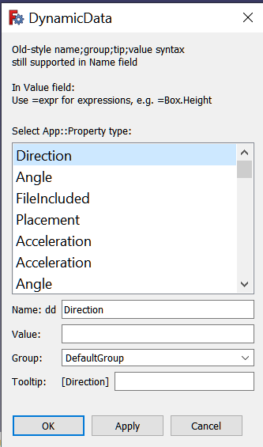
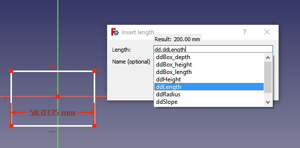

# DynamicData Workbench

## Overview

With this workbench you can create custom FeaturePython objects (herein referred to as DynamicData dd objects) to serve as containers for custom properties.  These custom properties can then be used in much the same way as cells in a spreadsheet.  Users can refer to a custom property in a sketcher constraint (or from anywhere the Expression Engine can be accessed) the same way one might refer to a cell in a spreadsheet.  Take note that FCStd files containing these DynamicData dd objects <b>can be shared</b> with other users who do not have the DynamicData workbench installed on there systems and yet will still remain fully functional.  (But without the workbench installed those other users will not be able to add/remove properties unless it is done via scripting.)

## Commands

### Create Object

Creates a new DynamicData container object.

### Add Property

Adds a new custom property to the selected DynamicData container object.  (If no DynamicData object is selected in the tree view this command will be disabled.)  

Adding custom properties is a 2-step process.  First step is to select the property type from the drop down list.

Second step is to give your new property a name and (optionally) a group name, tooltip, and an initial value.

All property names are prepended with `dd` automatically and the first letter is capitalized.  Thus, a name entered of `length` would be converted to `ddLength` and get displayed in the property view as `dd Length`.  The purpose for this is to make it easier to reference your properties later on.  For example, if you wish to reference a DynamicData custom property from a sketch constraint you can enter `=dd.dd` to bring up a list of available custom properties:  

  

In the same line edit widget where you enter the name of the property you may (optionally) include a new group name, tooltip, and set an initial value for the property.  Separate these with semicolons `;`  
Some examples:  

`radius;Barrel Properties;radius of the barrel;200mm`  

This would create a new property with the name `ddRadius` in the group named `Barrel Properties` with a tooltip `radius of the barrel` and an initial value of 200 mm.  

`height;;height of the barrel;12cm`

Assuming you created the first example (barrel radius) above the empty bit between the 2 semicolons tells the workbench to use the existing group name.  Thus, you would have a new property with name `ddHeight` in the group named `Barrel Properties` with a tooltip `height of the barrel` and an initial value of 12 cm.  

`depth;base dimensions;;32.5`  

New property has name = `ddDepth` in group name `base dimensions` with no tooltip and an initial value of 32.5 mm (assuming you are using mm as your default units).

`length`

New property has name = `ddLength` in group named `DefaultGroup` (unless the group name default has been changed by previously naming a new group name for a previous property this session) with no tooltip and initial value of 0 (or suitable initial value for other property types).

The initial value has some fairly good expression evaluation built-in, but it doesn't use the expression engine to do the evaluations.  It uses its own expression evaluator.  If it fails, no problem, you will get a warning message in the report view and status bar, and you can just set your desired value using the property editor.  

`diameter;;;25.4*20*2`

Sets new property name = `ddDiameter` using default group name, no tooltip, and setting initial value to 25.4 * 20 * 2, which could be useful if you wanted to set a diameter of 40 inches, given a radius of 20 inches and your default units is set for mm.  

Using group names to organize your properties can be very useful where you have lots of properties in your model.  There is no way at this time to edit group names; they must be given at the time the property is added to the container object.  Properties will be listed in alphabetical order within the group name hierarchy.

Tooltips can be very useful as reminders to yourself (and to others) of the use of the property.  This information is displayed when the user hovers the mouse over the property.  You can also include multi-line descriptions in the form of StringList property types.  (List types can be set to initial values by separating the initial values with commas.)

### Remove Property
  
TODO

### Settings
  
TODO

 
 

#### Release notes:

* v2018.09.19  2018.09.19:  Initial version
