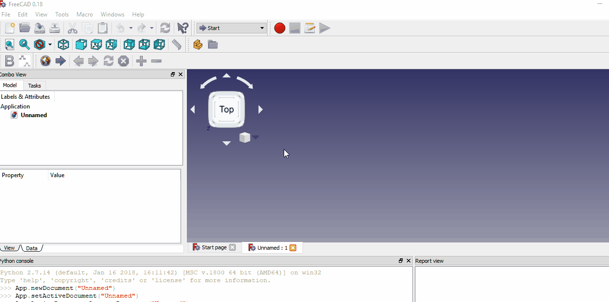
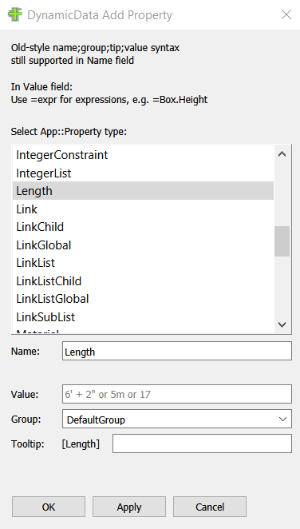
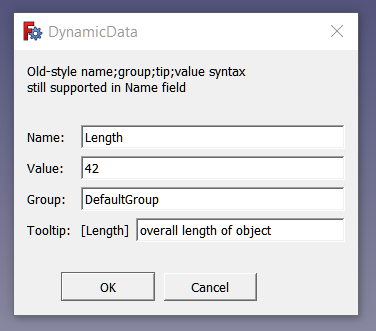
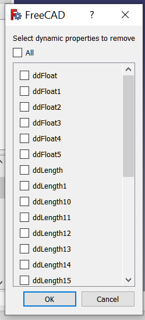
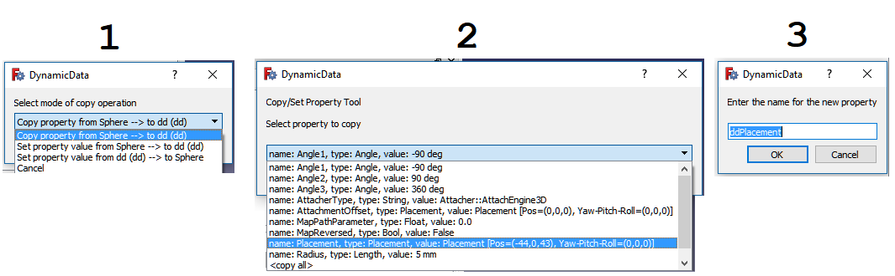

# DynamicData Workbench

## Installation

Install via the Addon Manager in the Tools menu in FreeCAD version 0.17 and later.

## Overview

With this workbench you can create custom FeaturePython objects to serve as containers for custom properties.  These custom properties can then be used in much the same way as cells in a spreadsheet.  Users can refer to a custom property in a sketcher constraint (or from anywhere the Expression Engine can be accessed) the same way one might refer to a cell in a spreadsheet.  Take note that FCStd files containing these DynamicData dd objects <b>can be shared</b> with other users who do not have the DynamicData workbench installed on there systems and yet will still remain fully functional.  (But without the workbench installed those other users will not be able to add/remove properties unless it is done via scripting.)

### Example Video:

### Warning Message:
You might see this warning message in the report view: <b>"Enumeration index -1 is out of range, ignore it".</b>  This is a FreeCAD warning related to the DisplayMode property, which can be safely ignored, since the dd container objects are not intended to be displayed in the 3d view and do not have view objects.  I have added a workaround for this issue in version 1.3, so hopefully dd objects created with version 1.3+ will no longer show this warning upon being loaded from disk.

### Create Object

Creates a new DynamicData container object.

### Add Property

Adds a new custom property to the selected DynamicData container object.  (If no DynamicData object is selected in the tree view this command will be disabled.) 
 
Adding custom properties is a 2-step process.  First step is to select the property type from the drop down list. 
 

 
Second step is to give your new property a name and (optionally) a group name, tooltip, and an initial value. 
 
<b>Note: as of version 1.12 all tooltips now get [Type] prepended.  Example, if type is "Length" the tooltip would be something like "[Length] my tooltip".</b> 
 
 
 
I know this looks complicated, but remember all you really need to do is enter a name for the property.  The value can be set later using the property editor.  The other stuff is just setting a name for the group to place the property in, if other than the default group, setting a tooltip, and setting the value of the property during the time of creation rather than later in the property editor. 
 
All property names are prepended with "dd" automatically and the first letter is capitalized.  Thus, a name entered of "length" would be converted to "ddLength" and get displayed in the property view as "dd Length".  The purpose for this is to make it easier to reference your properties later on.  For example, if you wish to reference a DynamicData custom property from a sketch constraint you can enter "=dd.dd" (or click the expression engine "fx" icon and enter "dd.dd") to bring up a list of available custom properties:  
 
 
 
In the same line edit widget where you enter the name of the property you may (optionally) include a new group name, tooltip, and set an initial value for the property.  Separate these with semicolons (;).  Some examples:  
 
<b>radius;Barrel Properties;radius of the barrel;200mm</b> 
 
This would create a new property with the name "ddRadius" in the group named "Barrel Properties" with a tooltip "radius of the barrel" and an initial value of 200 mm. 
 
<b>height;;height of the barrel;12cm</b> 
 
Assuming you created the first example (barrel radius) above the empty bit between the 2 semicolons tells the workbench to use the existing group name.  Thus, you would have a new property with name "ddHeight" in the group named "Barrel Properties" with a tooltip "height of the barrel" and an initial value of 12 cm. 
 
<b>depth;base dimensions;;32.5</b> 
 
New property has name = "ddDepth" in group name "base dimensions" with no tooltip and an initial value of 32.5 mm (assuming you are using mm as your default units). 
 
<b>length</b> 
 
New property has name = "ddLength" in group named "DefaultGroup" (unless the group name default has been changed by previously naming a new group name for a previous property this session) with no tooltip and initial value of 0 (or suitable initial value for other property types). 
 
The initial value has some fairly good expression evaluation built-in, but it doesn't use the expression engine to do the evaluations.  It uses its own expression evaluator.  If it fails, no problem, you will get a warning message in the report view and status bar, and you can just set your desired value using the property editor. 
 
<b>diameter;;;25.4*20*2</b> 
 
Sets new property name = "ddDiameter" using default group name, no tooltip, and setting initial value to 25.4 * 20 * 2, which could be useful if you wanted to set a diameter of 40 inches, given a radius of 20 inches and your default units is set for mm. 
 
Using group names to organize your properties can be very useful where you have lots of properties in your model.  There is no way at this time to edit group names; they must be given at the time the property is added to the container object.  Properties will be listed in alphabetical order within the group name heirarchy. 
 
Tooltips can be very useful as reminders to yourself (and to others) of the use of the property.  This information is displayed when the user hovers the mouse over the property.  You can also include multi-line descriptions in the form of StringList property types.  (List types can be set to initial values by separating the initial values with semicolons.) 
 
Here is an example of initializing a FloatList type with a list of floating point values.  First, select FloatList as the property type, then when naming the new property: 
 
<b>mylist;group name for lists;my tooltip;0;2;3.1;e;4</b> 
 

 
Did you notice the value 'e'?  This is one of the constants the built-in expression evaluator understands to mean Euler's constant, E, the root of natural logarithms: 2.718...  Other constants recognized: pi (3.14...), phi (aliases: golden, golden ratio = 1.6180339887), inch (aliases: in, inches = 2.54), and thou (0.0254).  You would use inches, inch, and thou by multiplying them by a value you enter in inches where your default units in FreeCAD is set as mm.   
 
Example: <b>myInchValue;myGroup;myTip;10*inches</b>  
 
(But, if you use 'in' instead of inch or inches, just use it as you would normally in FreeCAD's expression engine: 6in or 6 in.) 
 

### Remove Property
 
 
Use this tool to remove a property previously added using the Add Property tool.  Select the property in the list you would like to remove.  You may also choose to remove all properties in one go. <b>(Care must be taken when removing properties because this action cannot be undone.)</b> 
 
 
 
### Import Aliases
 
Use this to import aliases from selected spreadsheets as properties into selected dd object. 
 
<b>Warning: selected spreadsheets will be modified.  The cells containing the aliases will reference
the dd object property. </b> 
 
To prevent a cell containing an alias from being imported you should end the alias name with an underscore (_).  When the workbench code sees an alias name that ends with an underscore it will skip that alias and display a warning message in the report view, informing the user that this alias was skipped.  Similarly, spreadsheets with labels ending in the underscore will likewise be skipped. 
 
To use this feature, select your dd object and one or more spreadsheets to be imported, then invoke the command either from the menu or the toolbar.  New properties of various types, e.g. "Length" will be added to the dd object for each alias found.  The property type depends on who FreeCAD has interpreted the type to be, which is based on the units used in the cell contents.  For example, "10.5 mm" would be seen as a "Length" property type while "45 deg" would be seen as an "Angle" property type, "5 mi/h" would be seen as a "Speed" type, etc.  Note: there could be some inconsistencies between the unit types recognized by the spreadsheet code and the property type names used in FreeCAD.  Please report any errors to me via Direct Message "TheMarkster" on the FreeCAD forum.  As an example of this type of mismatch, "Speed" types are identified as "Velocity" in the spreadsheet, so a minor fix is needed (already done in version 1.41) in the DynamicData source code to account for this naming inconsistency. 
 
Once you have imported the aliases you should still keep the spreadsheet because other FreeCAD objects, example sketch constraints, that were referencing the aliases before the import will still be referencing them.  Difference is now the spreadsheet references the dd object property.  Keep the spreadsheet, but only make modifications to the values in the dd property editor.  Otherwise, the changes made in the spreadsheet will break the connection to the dd object property. 
 
Another important consideration is the imports are done by value and not by reference.  In other words, suppose you have an aliased cell with a formula such as "=B1 * A2 - C3".  The import will be whatever value that formula evaluates to *at the time of the import*.  If you later modify the contents of B1, A2, or C3, those changes *do not* get propagated to the dd object property.  In other words, if B1 * A2 - C3 evalates to 15.23, then 15.23 is what gets imported.  I've hesitated to include this feature mostly because of this issue that could come up, but I've decided to let the user decide for himself whether to use this or not. 
 
This operation can be partially undone using FreeCAD's undo toolbar command.  The undo operation will undo the changes made to the imported spreadsheet, resetting all cells back to their former state, but it will not remove the newly created properties from the dd object.  But while the properties remain they will no longer reference anything else in the document or be referenced by anything else in the document, so they will be harmless in that sense.  Still, it is recommended to save your document before using this feature. 
 

### Import Named Constraints
 
Use this to import named constraints from selected sketches as properties into selected dd object. 
 
<b>Warning: selected sketches will be modified.  All named constraints will reference the dd object property.</b> 
 
To prevent a named constraint from being imported, append an underscore to the constraint name.  For example, a radius constraint named "myRadius_" will be ignored.  Similarly sketches with labels ending in an underscore are also ignored, e.g. "Sketch_" cannot be imported. 
 
To use this feature, select your dd object and one or more sketches to be imported, then invoke the command either from the menu or the toolbar.  New properties of type "Length" will be added to the dd object for each named constraint found except "Angle" type will be used for "Angle" constraint types. 
 
<b>Care should be taken if the constraint uses the expression engine because only the value of the expression is used, not the expression itself, which could be a formula or a reference to some other constraint, property, or spreadsheet alias.</b>  For example, suppose you have a constraint named "radius" with an expression "Sketch.length*2" with a value of 2.75mm.  This would create a new property in the dd object named ddSketchRadius with a value of 2.75mm and the constraint is now set to "dd.ddSketchRadius".  The upshot of this is if you change the value of the Sketch.length constraint the ddSketchRadius property is NOT updated.  In such cases you should alter the value of the ddSketchRadius property so that it once again references that length property, presumably now called ddSketchLength. 
 
This operation can now be partially undone (as of version 1.40).  If you use FreeCAD's Undo toolbar icon (or CTRL+Z on Windows) the sketch will be reset back to its former state before the import, but the newly created dd property objects will remain.  The new properties will not reference anything else and will not be reference by anything else, but the Undo operation does not delete properties.  It is suggested to make a backup copy of your .FCStd file before using this feature. 
 
### Copy Property
 
 
Copy a property from one object to another or within the same dd object.  Properties can only be copied to a dd object, but the source can be a non-dd object or a dd object (including copies from within the same dd object).  Can also be used to set the value of an existing property rather than creating a new property.  To use, just select the object containing the original property to be copied and the dd object that will contain the new property, then click the Copy Property icon.  You will be guided through the process with a series of dialogs. 
 
One potential application for this feature is to make copies of placement properties.  These copies can then be used to easily set the original objects Placement property to any of the values held by any of the placement copies.  For example, your model might include a lever that can be in any of 3 positions, say forward, neutral, and reverse.  Move it to the forward position, and then make a copy of the placement.  Move it to the neutral position, and do the same, ditto for the reverse position.  Your dd object could contain 3 placement properties: ddForward, ddNeutral, and ddReverse. 
 
#### Copy a property from another object to a dd object 
 
In this example we will copy a placement property from a Sphere to a dd object.  Select the Sphere and the dd object in the tree view, and then click the Copy Property icon in the toolbar (or select via the menu).  1) select the Copy property from Sphere --> to dd (dd) option and click OK.  2) You will be presented with a list of the properties available to be copied from the Sphere object, select the Placement property and click OK.  3) Give the new property to be created a new name or just click OK to accept the default name chosen for you.  (Note: if the new name you give conflicts with an existing property name in the dd object you will be prompted again for a new name, so if you see this multiple times it means there is a name conflict.) 
 
 
 
#### Set a property value  
 
The process for this is substantially the same as for copying a property except you will need to select an existing property in the target object to receive a new value rather than giving a name for a new property to be created.  It is important to match the property types when trying to copy the value from one property to another or else the operation is likely to fail.  (But note there are cases where it might work to copy a property value of one type to another property of a different type, for example, an Integer value can be copied to a Float property.)  There is no error checking being done to prevent you from trying to copy a value from one property type to another, but once the from property is chosen, then when selecting the to property to receive the value the properties that are of the same type as the from property will be displayed at the top of the selection list for your convenience. 
 

### Settings

Use this to change workbench settings.

#### Keep Toolbar
Setting this to True (default is True) means the DynamicData toolbar will remain active even after switching away from the DynamicData workbench.  This value is stored in FreeCAD's parameters, accessible via Tools menu -> Edit Parameters.  This parameter is a Boolean type in BaseApp -> Preferences -> Mod -> DynamicData -> KeepToolbar. 
 
You must always open the DynamicData workbench at least once per FreeCAD session in order to first initialize the workbench toolbar.  If you would like to have the DynamicData toolbar icons always available without need to visit the DynamicData workbench you may configure DynamicData as your default startup workbench so that whenever you start FreeCAD it opens in the DynamicData workbench. (Edit -> Preferences -> General -> Startup -> Autoload module after startup -> DynamicData.) 
 
There is also an option in the Edit -> Preferences -> Start -> Options section to load DynamicData after creating / opening an existing document from the start page. 
 
#### Change length of most recently used type list
When you add a new property type you are presented with a list of property types to select from. This list is sorted alphabetically beginning with "Acceleration".  But before we get to the "Acceleration" property type we have at the top of the list the most recently used property types, which are sorted in the order of most recently used.  This setting allows you to choose how many of the most recently used property types you want listed before we get to the rest of the alphabetized list.  A setting of 0 here would disable the most recently used list.  Default is 5.  Maximum is 25.  This value is stored in FreeCAD's parameters, accessible via Tools menu -> Edit Parameters.  This parameter is an Integer type in BaseApp -> Preferences -> Mod -> DynamicData -> mruLength. 
 

#### Release notes: 
* 2019.07.05 (version 1.43) 
** fixed bug in resetting length of mru list 
* 2019.06.30 (version 1.42) 
** fixed bug in mru list 
** added setting for length of mru (0-25) 
* 2019.06.29 (version 1.41) 
** minor bug fix 
* 2019.06.29 (version 1.40) 
** adds spreadsheet alias import feature 
** adds undo capability to sketch import feature 
* 2018.10.03 (version 1.31) 
** transparent background icons 
* 2018.10.02 (version 1.30) 
** Add copy/set property 
* 2018.09.27 (version 1.20) 
** Add sketch import 
* 2018.09.25 (version 1.11) 
** bugfixes, handle empty names better 
* 2018.09.24 (version 1.1)  
** Add 5 most recently used types to top of property type list, sort remainder. 
** Display version information in DynamicData string property  
* v2018.09.19  2018.09.19:  Initial version 

