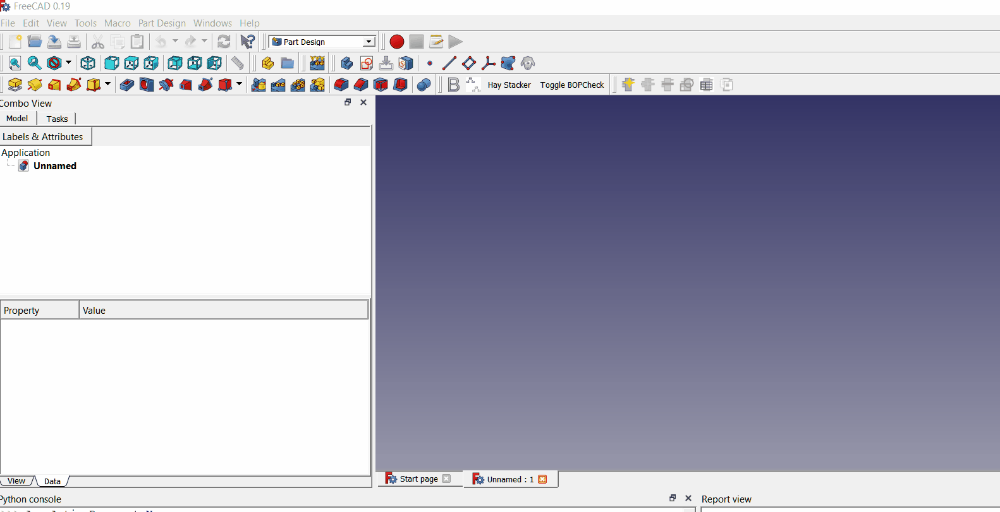
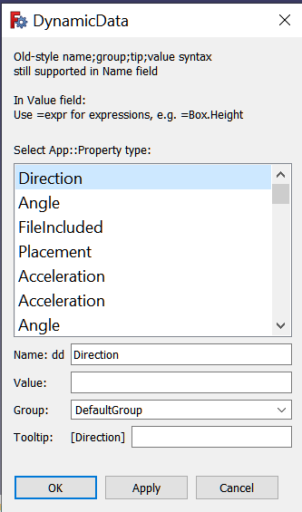
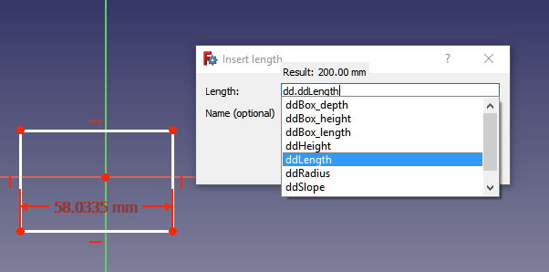
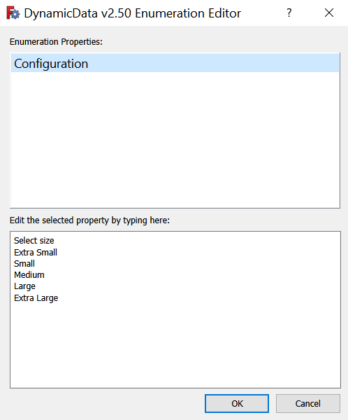
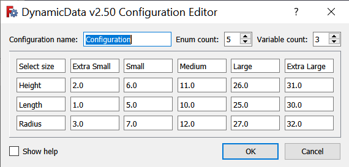
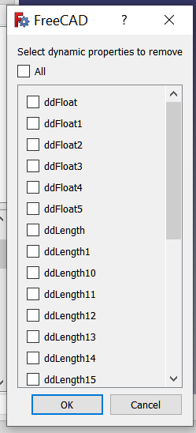
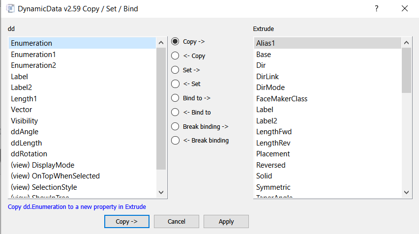

# DynamicData Workbench


A [FreeCAD](https://freecad.org) workbench for creating and managing custom dynamic property container objects.

## Installation

Install via the [Addon Manager](https://wiki.freecad.org/Std_AddonMgr) in the Tools menu in FreeCAD version 0.17 and later.

You will also want to install this <a href="https://forum.freecad.org/viewtopic.php?t=31137&start=20#p707826">macro</a>, which allows to add new properties to the dd object while the sketch editor is open.

## Overview

With this workbench you can create custom FeaturePython objects to serve as containers for custom dynamic properties.  These custom properties can then be used in much the same way as cells in a spreadsheet.  Users can refer to a custom property in a sketcher constraint (or from anywhere the Expression Engine can be accessed) the same way one might refer to a cell in a spreadsheet.  Take note that FCStd files containing these DynamicData dd objects <b>can be shared</b> with other users who do not have the DynamicData workbench installed on their systems and yet will still remain fully functional.

### Example Video:



### Create Object


Creates a new DynamicData container object.  Since DynamicData was first written FreeCAD has allowed all objects to receive dynamic properties, so you could put the custom properties in any object, but in doing so there is greater risk of creating inadvertently circular references between objects.  Another advantage to creating this container object is if it is the only such dd object in the document, then many of the toolbar commands can be active even where no object is selected.  (But if another object is selected, then the commands, such as the command to add a new property, will attempt to work on that object.)

### Add Property


Adds a new custom property to the selected object.  The selected object need not be a DynamicData dd object.  If no object is selected this command will be disabled unless there is only one Dynamic Data (dd) object in the document, in which case the dd object will be used.



After selecting the property type, the next step is to give your new property a name and (optionally) a group name, tooltip, and an initial value.<br/>

All tooltips now get `[Type]` prepended.  Example, if type is `Length` the tooltip would be something like `[Length] my tooltip`.
* `Old style name;groupname;tooltip;value` syntax is still supported in the `Name` field for those who wish to keep using it.  In the old style, before the introduction of this new dialog, all of this information was entered into a single text field.  The syntax for this method is propertyname;groupname;tooltip;value.  You can still enter all of this into the name field if you like, but I doubt anybody is still doing it this way.

Property names are no longer prepended with `dd` automatically.  The prefix is no longer needed with recent versions of FreeCAD where the bug in the expression engine has now been fixed.  If you wish to still continue using the dd prefix you can still do so when you create your property name.  I considered adding a preference for this, but rejected the idea after some deliberation, feeling it would unnecessary complicate the code.  Below is a screenshot of the expression engine property suggestion box that pops up when entering a property reference.



DynamicData's built-in evaluator has been replaced with FreeCAD's integrated expression evaluator.  This simplifies the code, and since the expression evaluator is what has the final say on how values get interpreted, this creates a more uniform format for property values.  But I still did some custom evaluations for some property types to make them easier for the user to input starting values.  For example, when setting the initial value for a new Vector property type you can simply enter "(10,20,30)" in the value field in DynamicData's add property dialog, but this won't work when entering it directly into the expression engine.  Behind the scenes in DynamicData some preprocessing is done to make that entry work.  Similarly, for the Color property types you can enter the desired color in 3 different formats, for example for the color red you could enter: "(255,0,0)" or "#ff0000" or simply "red" (without the quotes).  You can also leave the value field blank and later select the desired color from a color picker dialog in FreeCAD.

**Note:** even though your value will be evaluated by the FreeCAD expression engine, you don't get the benefit of being prompted with autocompletions when entering it into the value field.  But for many property types some preprocessing is done and you get a sort of preview of what the value will be.  This information pops up in a QLabel that is between the property name field and the value field in the add property dialog.

You will notice in the above add property dialog screenshot that for the Length property type there is some default placeholder text giving a very brief summary of some example value entries for that property.  This is true for many property types.  Often there are alternative entry formats that will also work.  Generally, you can use commas in place of semicolons.  If the preprocessor is able to successfully parse and evaluate your value field entry, then it will most probably be a successful operation when the workbench attempts to set the property to the desired value, but the preprocessor does not always take into account the property type you are using and not all values, of course, will be compatible with all property types.  You can't put a list into a Float property, for example.  For that you need the FloatList type.

### Some examples

```
=(7/8)*25.4
=Cylinder.Radius*2
=list(3;2;1)
=list(create(<<vector>>; 2; 1; 2);create(<<vector>>; 0;0;0))
3*5
cos(pi)
goldenrod --(for the Color property type)
```

For List property types, e.g. IntegerList or FloatList, you can separate the values by semicolons:

```
3;5;9;12
```

or if using the expression engine:

```
=list(3;5;9;12)
```

For Enumeration types you enter the enumerations as a list:

```
("zero","one","two","three","four")
["zero";"one";"two"]
```

You will probably find it simpler to leave the Enumeration value blank, and then use DynamicData's Edit Enumerations command to fill in the values.  Enumeration properties are always lists of strings.  When the enumeration is accessed via the Expression Engine, such as in a spreadsheet, the result is an integer corresponding to the index of the selected enumeration item.  For example, in the above enumeration if the user selects four, then the value returned by `=dd.ddMyEnum` is 4 because "four" is the 5th item in the enumeration and because this is a 0-indexed list.

You may make use of these enumeration properties by also creating another list property, such as IntegerList, FloatList, or StringList that contains the same number of elements as the enumeration.  See also the section below on Configurations for more ideas on using these versatile Enumeration property types.  For example, make an IntegerList called MyInts:

```
0;1;2;3;4;5;6;7
```

Then in a spreadsheet `=dd.ddMyInts[dd.ddMyEnum]` would return the integer in MyInts that corresponds to the user selection in MyEnum.  For example, if the user has selected "zero" in the enumeration, then this cell in a spreadsheet would hold the value of 4.

Make an enumeration MyEnum:

```
False;True
```

Since this evaluates to 0 or 1 depending on user selection it could be used as a boolean:

`=dd.ddMyEnum ? 5 : 7` (would yield a value of 5 if True, 7 if False)

For the Link property type (not App::Link objects, but the property that links to another object) you can simply enter the object's name or label.  If the evaluation label says "None" then that means it wasn't able to find the object.  Double check the spelling.  Something similar can be done for other Link types, such as LinkList and LinkSubList.  Follow the initial placeholder text for guidance on the syntax for setting the default values for advanced property types.  If there is already a value there in the Value field, clear it to see the placeholder text.

### Edit Enumerations


Use this tool to edit the enums in an Enumeration property.  If there are more than one enumeration properties in the document you can use the list widget in the dialog
to select the enumeration property to edit.  Editing is just a matter of typing the new enums into the text field at the bottom of the dialog, one line per enum.  Note: you must have an enumeration property already in the object.  Create one with the add property tool, and then use this tool to edit it.  FreeCAD does provide an editor for these property types, but you have to jump through a few hoops to get to it.  Right click a property label -> show all, then expand the enumration in the tree, and click the [...] button to open the editor.  Or, you can edit them with DynamicData.



### Create/Edit Configuration


Use this tool to create a configuration.  A configuration is a set of properties that are controlled by a single enumeration property.  The screenshot below shows the
configuration editor dialog in v2.50.



The configuration name is the name of the enumeration property and also the name of the group that the properties that get created will go into.  Another group with this same name, but with "List" added to it is created, and in that group will be put the List properties needed for the configuration.

The enum count is the number of enums in the configuration, a value constrained to be between 2 and 100, inclusive.  In the screenshot the enums are: Extra Small, Small, Medium, Large, and Extra Large.  These strings (and the Select size string) will be in the enumeration property.  As an example, when you select Small as the enum in the configuration, then Height = 6.0, Length = 5.0, and Radius = 7.0.  You're able to change all 3 to this preset configuration all in one go merely by selecting small in the enumeration property.

The variable count is the number of variables.  In the screenshot we have 3: Height, Length, and Radius.  You can have as few as 2 and as many as 100.  For each variable you get 2 new properties: variable name and variable name List.  Example, in the screenshot above you would get a Height property and a HeightList property.  Height will hold the current value as determined by the enum selected in the enumeration property as indexed into the HeightList property.  All variables at this time are type Float and all lists are of type FloatList.  Note: You can still bind another integer or boolean property to a float property and it will work just fine.  For integer binding you will get the rounded value and for boolean properties you get False for 0 and True for all other values.

When you press OK the configuration is created.  Any empty cells will get the value of the first cell in that row unless it is also empty, in which case the empty cells get 0.0.

When Select size (or whatever text you edit that to become) is the selection in the enumeration property, all of the values will generally be the first enum.  In the above example, when Select size is visible as the selected enum, then the variables will all take the Extra Small values.  This is because there is a special hidden column at the end of the List properties that gets filled with that first value in each row.  You can later edit these manually by editing the List properties if you want different defaults.  The new values will be retained if you edit the configuration, but not if you edit the enum count, in which those manually entered values will be lost and reset to the Extra Small values, in this case.

Toggle the Show help checkbox to see some additional information while the dialog is open.

### Remove Property


Use this tool to remove a property previously added using the Add Property tool or the Copy property command.  Select the property in the list you would like to remove.  You may also choose to remove all properties in one go. This only works on dynamic properties that you have added, and not on an object's build=in properties, such as the Radius property of a Part workbench Cylinder primitive.  If you don't see the property in the dialog, then it could be because it is not a dynamic property.  **Note:** This action can be undone with Undo/Redo in FreeCAD.



### Import Aliases


Use this to import aliases from selected spreadsheets as properties into selected object.  The selected object need not be a DynamicData dd object, but care must be taken to avoid circular references if not using a dd object.

**Warning: selected spreadsheets will be modified.  The cells containing the aliases will reference
the dd object property.**

To prevent a cell containing an alias from being imported you should end the alias name with an underscore (`_`).  When the workbench code sees an alias name that ends with an underscore it will skip that alias and display a warning message in the report view, informing the user that this alias was skipped.  Similarly, spreadsheets with labels ending in the underscore will likewise be skipped.

To use this feature, select your dd object and one or more spreadsheets to be imported, then invoke the command either from the menu or the toolbar.  New properties of various types, e.g. `Length` will be added to the dd object for each alias found.  The property type depends on what FreeCAD has interpreted the type to be, which is based on the units used in the cell contents.  For example, `10.5 mm` would be seen as a `Length` property type while `45 deg` would be seen as an `Angle` property type, `5 mi/h` would be seen as a `Speed` type, etc.  Note: there could be some inconsistencies between the unit types recognized by the spreadsheet code and the property type names used in FreeCAD.  Please report any errors to me via Direct Message "TheMarkster" on the FreeCAD forum or create an issue here on github.  As an example of this type of mismatch, "Speed" types are identified as "Velocity" in the spreadsheet, so a minor fix is needed (already done in version 1.41) in the DynamicData source code to account for this naming inconsistency.

Once you have imported the aliases you should still keep the spreadsheet because other FreeCAD objects, example sketch constraints, that were referencing the aliases before the import will still be referencing them.  Difference is now the spreadsheet references the container object property.  Keep the spreadsheet, but only make modifications to the values in the dd property editor.  Otherwise, the changes made in the spreadsheet will break the connection to the dd object property.

Now, as of version 2.68, cells consisting of expressions will be imported as expressions instead of by value.  Hopefully, all the references will remain intact.  These must be wrapped inside href() to prevent FreeCAD from refusing to add the expression due to circular references.  This could on occasion requre an additional manual recompute of the dd object, so if this happens you can safely ignore the error message you get about dd still being touched.  Care must be taken when importing expressions not to create a circular reference.

This operation can be undone using FreeCAD's undo toolbar command.  The undo operation will undo the changes made to the imported spreadsheet, resetting all cells back to their former state, and it will remove the newly created properties from the dd object.  Still, it is recommended to save your document before using this feature.  "Save and save often," a wise man once said about FreeCAD.

**Previously, on import the alias names got edited with the dd prefix and with the name of the spreadsheet, but this is no longer the case.  The new properties get the same names as used for the aliases, and get into a new group, which is named after the spreadsheet from which they were imported.**

### Import Named Constraints


Use this to import named constraints from selected sketches as properties into selected dd object.

**Warning: selected sketches will be modified.  All named constraints will reference the dd object property.**

To prevent a named constraint from being imported, append an underscore to the constraint name.  For example, a radius constraint named `myRadius_` will be ignored.  Similarly sketches with labels ending in an underscore are also ignored, e.g. `Sketch_` cannot be imported.

To use this feature, select your dd object and one or more sketches to be imported, then invoke the command either from the menu or the toolbar.  New properties of type `Length` will be added to the dd object for each named constraint found except `Angle` type will be used for `Angle` constraint types.

As of version 2.66 now the imports are expression aware and will copy the expression used by the named constraint if it has an expression.  The expression will be wrapped inside an href() to prevent circular references since the constraint itself gets an expression linking it back to the dd object.

This operation can be undone with FreeCAD's Undo toolbar icon (or CTRL+Z on Windows) the sketch will be reset back to its former state before the import, and the newly created dd property objects will be removed.  It is suggested to save your file before using this feature, and then carefully ensure you are satisfied with the import before saving again.

### Copy Property


In previous versions this feature was a combination of a number of input dialog prompts, but has now been consolidated into a single dialog.  Here is a screenshot of the new dialog.



In this dialog you can copy a property from one object to another (or make a copy of the property in the same object if you only select one object before executing the command). Copying, in this context, means to make a new property of the same type as the original property and set it to the same value as the original, same tooltip, and same group name.  You can also "set" a value of one property to the value of another.  Setting, in this context, means updating the value of an existing property.  The distinction between copying and setting is that in copying a new property is created, while in setting an existing property is modified.  You can also "bind" a property to another via the expression engine.  When a property is bound to another property, then whenever that property changes, the bound property will change with it.  For example, you might have a property named Length in your dd object and you would like the Length property of a PartDesign::Pad to update itself automatically when you change the Length property of the dd object.  You can accomplish this with the bind command by binding the Pad's Length property to the dd object's Length property.  The properties need not have the same name, but they must be the same property type or else the workbench will not execute the command.  (You still might be able to do it in FreeCAD in some cases, for example binding a Length property to a Float property.)

### Rename Property

Rename a dynamic property.  The property must be dynamic, but need not be a DynamicData object.  FreeCAD does not natively support the renaming of properties, so the way this works is a new property of the same is created with the new name, and then the old property is deleted.  An attempt is made to move all dependency links from the old property to the new, but it is conceivable something might go astray during this process, so it is advised to ensure all the links were properly reconnected to the new property.  You can use Undo to undo this operation.  **Suggestion:** save your file before renaming, and then only once assured all went well should you save it again.  If something went wrong, then you can close the file without saving changes and reopen it (or use the Revert option the File menu.)

### Retype property

Change the type of a dynamic property.  Works similarly to rename property except instead of a new name you are given the choice to select the new property type.  There are some caveats to be aware of with this function.  It cannot be undone.  This is made quite clear with red text in all caps in the dialog.  So, it is a good idea to save your file before attempting it just in case you need to revert back later.  Because the property type is changing the value might not be retained if it isn't fully compatible with the new type.  As an example, attempting to convert a float to an int will fail in terms of retaining the value, so you will need to reset the value manually.  The opposite conversion, from integer to float should always work.  Consider also any objects that are referencing this property via the expression engine might get broken if changing the type breaks the expression being used.  For exmaple, the expression might be expecting a unitless type and you changed the property to a unit quantity type or vice versa.

### Set Tooltip

Change the tooltip of a dynamic property.  The tooltip is the brief message that is displayed when hovering the mouse pointer over the property in the property view.  This can be useful as a note to yourself or to other users as to the purpose of the property.

### Move to new group

Move dynamic properties to a different group, or create a new group to put them in.  This also allows to rename groups by moving all properties from it into a new group.  Only dynamic properties are supported, but the object container need not be a DynamicData object.

### Settings


Use this to change workbench settings.

### Keep Toolbar

Setting this to True (default is `True`) means the DynamicData toolbar will remain active even after switching away from the DynamicData workbench.  Enabling this also means the DynamicData context menu will remain active for both the tree and view context menus.  This value is stored in FreeCAD's parameters, accessible via Tools menu -> Edit Parameters.  This parameter is a Boolean type in BaseApp -> Preferences -> Mod -> DynamicData -> KeepToolbar.

You must always open the DynamicData workbench at least once per FreeCAD session in order to first initialize the workbench toolbar.  If you would like to have the DynamicData toolbar icons always available without need to visit the DynamicData workbench you may configure DynamicData as your default startup workbench so that whenever you start FreeCAD it opens in the DynamicData workbench. (Edit -> Preferences -> General -> Startup -> Autoload module after startup -> DynamicData.)

There is also an option in the Edit -> Preferences -> Start -> Options section to load DynamicData after creating / opening an existing document from the start page.

### Condensed toolbar
If this is enabled (default = True) a condensed version of the toolbar will be shown.  All of the DynamicData commands will grouped together under a single icon to take up less space on the toolbar.  (Changes to this setting will be applied after restarting FreeCAD.)

### Support ViewObject Properties

If this is True you will be able also to access properties in the view tab.  View tab properties will have (view) prepended to their property types in the selection dialog.  Manipulating these properties is the same as for the data tab properties except the view tab properties do not support parametric linking and you cannot add a new property to an object's view tab because FreeCAD does not support this operation.  You can copy a view object property to another object, but it will go into that object's data tab.

### Add to active container on creation

If this is True when you create a new dd object it will be added to the currently active container, if there is one active.  The container can be either a Part container or a Body (Part Design) container.  If you do not wish for the dd object to be in one of the containers you can always drag it out by dropping onto the document name in the tree view.  (But the opposite will not work for Part Design Body containers -- the dd object must be placed into the Body container upon creation of the dd object.)  Note: this does not change the scope of the dd object properties, which will always be global.

### Change length of most recently used type list

When you add a new property type you are presented with a list of property types to select from. This list is sorted alphabetically beginning with "Acceleration".  But before we get to the "Acceleration" property type we have at the top of the list the most recently used property types, which are sorted in the order of most recently used.  This setting allows you to choose how many of the most recently used property types you want listed before we get to the rest of the alphabetized list.  A setting of 0 here would disable the most recently used list.  Default is 5.  Maximum is 25.  This value is stored in FreeCAD's parameters, accessible via Tools menu -> Edit Parameters.  This parameter is an Integer type in BaseApp -> Preferences -> Mod -> DynamicData -> mruLength.

### Release notes
* 2025.11.26 (version 2.78)<br/>
** Add SPDX license identifiers
** Add SPDX file notices
** Update copyright headers 
* 2025.11.26 (version 2.77)<br/>
** update icon path in package.xml -- thanks @marcuspollio<br/>
* 2025.10.29 (version 2.76)<br/>
** internally reorganize python module structure -- thanks @PhoneDroid<br/>
* 2025.08.24 (version 2.75)<br/>
** add support for copying expressions -- thanks @fivethreeo<br/>
* 2025.04.12 (version 2.74)<br/>
** fix bug introduced with transition from pyside2 to pyside6 in the move to group comand<br/>
* 2025.02.27 (version 2.73)<br/>
** fix bug in property renaming where property being renamed is also referenced in same object<br/>
** add icons for all commands so they appear in the condensed toolbar
* 2025.02.26 (version 2.72)<br/>
** work around issue with requests package when checking for updates
* 2025.01.28 (version 2.71)<br/>
** add support for Temperature type
* 2024.11.15 (verison 2.70)<br/>
** check for existence of requests package
* 2024.11.06 (version 2.69)<br/>
** add command to change property type
* 2024.10.04 (version 2.68)<br/>
** handle expressions in imported aliases
* 2024.10.03 (version 2.67)<br/>
** fix bug in importing expressions from named constraints, must check if the expression pointsto another sketch, too.
* 2024.10.03 (version 2.66)<br/>
** when importing named constraints copy the expression if it has one.
* 2024.10.01 (version 2.65)<br/>
** fix update checking, broken due to recent changes to addon manager
* 2024.09.28 (version 2.64)<br/>
** better name validation for new properties, must avoid reserved keywords, like T, k
* 2024.09.22 (version 2.63)<br/>
** Condense the toolbar so it takes up less space on the toolbar, add setting to enable/disable this option (enabled by default).  If Keep toolbar is active, then also the DynamicData context menu is retained.
* 2024.04.17 (version 2.62)<br/>
** ensure only the first letter of the imported named constraint gets capitalized, leaving any other capitalized letters intact.
* 2024.04.16 (version 2.61)<br/>
** prepend sketch label to imported named constraint property name in dd object to avoid name conflicts
* 2023.12.19 (version 2.60)<br/>
** add information in add property dialog showing target object since it will not always be a dd object
* 2023.12.15 (version 2.59)<br/>
** drop dd prefix since it is no longer needed in newer versions of FreeCAD
** improve add property dialog
** check out the new Color property parser.  Now you can initialize your color in 3 ways: (255,0,0); red; #ff0000, and you get a nice preview of the color in the dialog.
** todo: update documentation to reflect new behavior
* 2023.12.14 (version 2.58)<br/>
** give copy dialog Ok and Apply buttons more meaningful labels and tooltips
* 2023.12.14 (version 2.57)<br/>
** rework copy/set/bind command to give it a proper dialog and to have more easily maintainable code
** activate some commands even where nothing is selected, using the only dd object in the document where there is only one.
** roadmap ahead -> document new copy/set/bind command; rework add property to remove "dd" prefix, support more document types than just dd objects
* 2023.12.12 (version 2.56)<br/>
** revamp sketch and spreadsheet imports
** now imported aliases and constraints keep original names and don't get ddIffied
** other changes: remove property, set tooltip, move/rename groups support non-dd objects, such as from Assembly4 or Path workbenches
** sketch and spreadsheet imports can also be done with non-dd objects since now all objects can have dynamic properties
** roadmap going forward --> rewrite copy/set commands, --> remove dd prefix from add property command
* 2023.12.12 (version 2.55)<br/>
** support Rotation property types
** refactor some code, adding a base command class from which the other command classes can inherit common functions (thanks to sphh for the idea)
** support Material property type (but since FreeCAD lacks a default editor these types are hidden -- use Show All in context menu to see, edit via python if you can work out how to do it
* 2023.11.13 (version 2.54)<br/>
** fix bug in configuration dialog where too many rows were being created <br/>
** set tab order correctly in configuration dialog, allow ctrl + tab to skip to next row<br/>
** fix compatibility issue with older versions of FreeCAD
* 2023.09.25 (version 2.53)<br/>
** ensure configuration editor dialog is deleted on closing<br/>
** remove unnecessary variable (self.ok) since we don't check it after dialog closes <br/>
** reword configuration selection qinputdialog from multiple found to select configuration <br/>
* 2023.09.24 (version 2.52)<br/>
** add new configuration option when opening the configuration editor on an object with one or more existing enumeration properties
* 2023.09.24 (version 2.51)<br/>
** fix small bug in configuration editor dialog when adding more than a single extra row or column to the grid
* 2023.09.24 (version 2.50)<br/>
** make configuration editor scrollable<br/>
** add selector dialog if multiple enumerations found in selected object <br/>
** fill empty cells in configuration editor with value from first enum in that row or 0.0 if that cell is also empty <br/>
** default values will now be from first enum when "select size" or similar is shown in enumeration property <br/>
** put removing properties in try: except: block<br/>
** do not try to add if property already exists and could not be removed during update of configuration<br/>
* 2023.09.23 (version 2.49)<br/>
** add configuration creation/editing<br/>
** use settings icon for settings dialog
* 2023.09.22 (version 2.48)<br/>
** add enumeration editor<br/>
** fix bug in apply button handling in add property dialog<br/>
* 2022.04.08 (version 2.46)<br/>
** do not require dd object be selected where there is only 1 dd object in the active document for these commands:<br/>
add property<br/>
remove property<br/>
rename property<br/>
edit tooltip<br/>
move to new group<br/>
* 2022.03.16 (version 2.45)<br/>
** various formatting fixes -- thanks luzpaz
** various issue of lgtm.com, unused variables, etc.
* 2022.03.15 (version 2.44)<br/>
** integrate property type selection into add property dialog
* 2022.03.15 (version 2.43(<br/>
** cleanup some code, remove some unnecessary recomputes during container object creation.
* 2022.03.15 (version 2.42)<br/>
** add set tooltip feature
* 2022.03.13 (version 2.41)<br/>
** add rename property command
* 2022.03.12 (version 2.40)<br/>
** update version information
* 2022.03.12 (version 2.39)<br/>
** add new command: move to new group<br/>
This also allows to rename groups by moving all properties from that group to a new group.<br/>
** improve selection of properties when removing properties, allowing from multiple selection.<br/>
* 2022.02.27 (version 2.38)<br/>
** add settings dialog to FreeCAD preferences
* 2022.02.26 (version 2.37)<br/>
** add settings dialog (thanks 0penBrain!)
* 2022.02.26 (version 2.36)<br/>
** Add another button added to dialog
* 2022.02.26 (version 2.35)<br/>
** make object creation undoable
* 2022.02.22 (version 2.34)<br/>
** add support for Enumeration property types
* 2022.02.22 (version 2.33)<br/>
** fix error message when running tests without Gui up
* 2021.07.25 (version 2.31)<br/>
** in adding new property and remove property dialogs Ctrl + OK = OK and Continue
* 2021.05.31 (version 2.3)<br/>
** in adding new property dialog put current group in an editable combo box
* 2021.05.17 (version 2.24)<br/>
** put cancel option at top of remove properties menu to help avoid accidentally deleting all properties
* 2021.05.16 (version 2.23)<br/>
** fix bug in spreadsheet import alias (prepend = sign to redirected spreadsheet cells)
* 2020.09.10 (version 2.22)<br/>
** fix update checker (and test)
* 2020.09.10 (version 2.21)<br/>
** testing check updater function
* 2020.09.10 (version 2.2)<br/>
** enable check for updates on workbench startup
* 2020.08.25 (version 2.1)<br/>
** enable undo and redo for adding/removing properties
* 2020.08.24 (version 2.01)<br/>
** slight modification to label in property creation dialog
* 2020.08.13 (version 2.0)<br/>
** adds ability to handle expressions in value box during property creation
** to use, prepend "=" to the value, for example:
** =(7/8)*25.4
** =Cylinder.Radius*2
* 2020.08.12 (Version 1.95)<br/>
** Change default shortcuts from Ctrl+D,A to Ctrl+Shift+D,A due to conflict with Ctrl+D tree display properties
* 2020.08.05 (version 1.94)<br/>
** support property type LinkSubList
* 2020.08.04 (version 1.93)<br/>
** switched to svg icons for those with higher def displays
* 2020.08.02 (version 1.92)<br/>
** changed default shortcuts due to potential conflicts
** Ctrl+D,C -- create new dd object
** Ctrl+D,A -- add new property to dd object
** Ctrl+D,R -- remove property from dd object
** Ctrl+D,S -- open settings
* 2020.08.01 (version 1.91)<br/>
** add default shortcuts:
** D,D,C (or ddc) create new dd object
** D,D,A (or dda) add new property to dd object
** D,D,R (or ddr) remove existing property from dd object
** D,D,S (or dds) open settings
* 2020.07.22 (version 1.90)<br/>
** add option to put new dd object into current active container (part or body)
** improve settings by add asterisk (*) before currently set option
* 2020.07.20 (version 1.83)<br/>
** fix a bug where creating new body caused properties to no longer get added to dd object
* 2020.07.12 (version 1.82)<br/>
** fix a bug related to evaluating some values
* 2020.06.23 (version 1.81)<br/>
** check for existing property name before creating property
* 2020.06.23 (version 1.80)<br/>
** add support for VectorList type (requires recent build of 0.19)
* 2020.03.01 (version 1.76)<br/>
** bugfix: import constraints was giving error when linking to new dd property
* 2020.03.01 (version 1.75)<br/>
** make create parametric links option default when copying/setting
** create parametric links only in the non-dd objects when copying
* 2020.02.27 (version 1.74)<br/>
** maintenance issue due to code changes in spreadsheet workbench
** treats int types as floats since that will likely be users'
** expectations for handling values, such as 10.0 as float not int
* 2019.08.13 (version 1.73)<br/>
** bugfix -- typo
* 2019.08.08 (version 1.72)<br/>
** make simple copy default instead of parametric link
** bugfix with copy all when user cancels midway<br/>
* 2019.08.08 (version 1.71)<br/>
** remove unused help button from dialogs
** fix recent types list -- sigh<br/>
* 2019.08.08 (version 1.70)<br/>
** revamp add property dialog<br/>
* 2019.08.06 (version 1.61)<br/>
** fix but (yet again) in most recent types list
* 2019.07.27 (version 1.60)<br/>
** add support for ViewObject properties<br/>
* 2019.07.26 (version 1.50)<br/>
** add ability create parametric links when setting/copying<br/>
* 2019.07.17 (version 1.44)<br/>
** do not import non-driving reference mode constraints<br/>
* 2019.07.05 (version 1.43)<br/>
** fixed bug in resetting length of mru list<br/>
* 2019.06.30 (version 1.42)<br/>
** fixed bug in mru list<br/>
** added setting for length of mru (0-25)<br/>
* 2019.06.29 (version 1.41)<br/>
** minor bug fix<br/>
* 2019.06.29 (version 1.40)<br/>
** adds spreadsheet alias import feature<br/>
** adds undo capability to sketch import feature<br/>
* 2018.10.03 (version 1.31)<br/>
** transparent background icons<br/>
* 2018.10.02 (version 1.30)<br/>
** Add copy/set property<br/>
* 2018.09.27 (version 1.20)<br/>
** Add sketch import<br/>
* 2018.09.25 (version 1.11)<br/>
** bugfixes, handle empty names better<br/>
* 2018.09.24 (version 1.1)<br/>
** Add 5 most recently used types to top of property type list, sort remainder.<br/>
** Display version information in DynamicData string property <br/>
* v2018.09.19  2018.09.19:  Initial version
